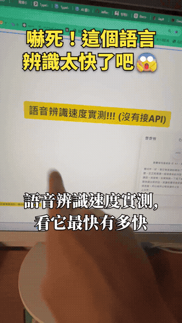
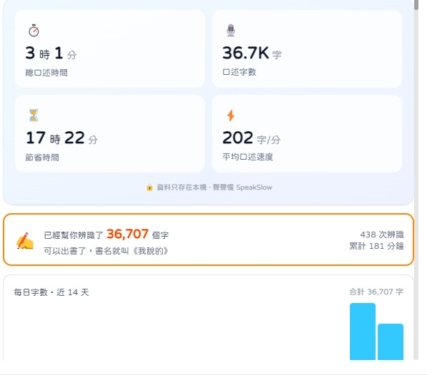
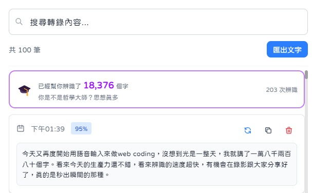

<div align="center">

<br/>


# 聲聲慢 (SpeakSlow)

### 讓每一個字，都被聽見

**專為中文打造、最快的本地語音輸入。用講的取代打字，講完直接送給 AI。**


🌐 **[官方網站 / 介紹頁](https://jeffrey0117.github.io/SpeakSlow/)** ・ 📖 **[完整使用教學](https://jeffrey0117.github.io/SpeakSlow/#/guide)**

</div>

<br/>

> 按一下 **右 Alt / 右 Ctrl** → 講中文 → 文字**自動貼到你游標所在的位置**。
> 語音辨識**完全在你電腦本地運行**，一個字都不上雲。

<div align="center">



🎬 <a href="https://jeffrey0117.github.io/SpeakSlow/demo.mp4">高畫質影片版</a>（講完即貼，全程本機）

</div>

<br/>

## ✨ 它能做什麼

### 🎙️ 又快又準的本地辨識
- **本地** sherpa-onnx **Paraformer（int8、非自回歸）**：講完約 **0.3 秒**貼上
- **為中文 / 台灣優化**：簡轉繁用台灣標準字（「吃」不是「喫」）；中英混用（晶晶體）英文保留原文、不亂翻
- **長講邊錄邊算**：錄音中先解碼講完的段落，停止後不論講多長都約 0.2 秒出字（實測 101 秒長講快 8 倍）
- **防幻聽**：不講話絕不會冒出文字，靜音與環境噪音直接拒絕解碼；長音訊自動 VAD 分段，講一大段也完整
- **熱詞 / 自訂字典**：提升人名、產品、術語等專有名詞的準確度

### 🧹 乾淨的輸出（以下全部**不需要 AI**、純本地規則）
- **自動標點**：依語意 + 句末語助詞（嗎 → ？、啊 → ！）
- **去口吃贅字**：刪掉「呃、嗯、那個、然後…」，但保留正常疊字（慢慢、謝謝）
- **全形英文 → 半形**：`ｈｅｌｌｏ` → `hello`
- **規則式列點排版**：講「第一…第二…第三…」自動變成 `1. 2. 3.` 清單、引言補冒號
- **停頓斷行**：用逐字時間戳偵測你講話的**停頓**，在自然換氣處自動換行（真正的韻律斷句）

### ⌨️ 順手的互動
- **右 Alt / 右 Ctrl 一鍵切換**：按一下開始、再按一下停止並貼上；錄音中 `Esc` 取消（瀏覽器裡用右 Ctrl 避開選單）
- **貼到游標處、不污染剪貼簿**：貼上後自動還原你原本的剪貼簿內容
- **面板一鍵 AI 開關**：不需要潤飾時直接關掉，省 API、要時再開

### 🤖 AI 文字優化（可選：要更強再開）
- 接任何**相容 OpenAI** 的服務：DeepSeek / Gemini / OpenAI，或**本地 Ollama（全離線、免 API key）**
- 內建為**台灣口語**調校的 prompt：潤飾、糾錯、整理排版
- 一鍵預設，填上 key 即用

### 📊 數據與歷史
- **可分享的數據儀表板**：總口述時間、口述字數、節省時間、平均速度（截圖就能炫耀）
- **每日字數趨勢圖**
- **完整歷史**：搜尋、統計、匯出
- **錄音永久保存**：辨識不滿意可**一鍵重新辨識**，甚至用 **Whisper** 換更強的模型重辨

## 📊 作者本人天天在用（不是做好看的）

<div align="center">



<em>口述 3 小時 = 省下 17 小時打字。有一天講了一萬八千字，可以出書了，書名就叫《我說的》。</em>
</div>

## 🔒 隱私：100% 本地，聲音不外流

語音辨識在**你自己的電腦**跑，**聲音不上傳任何伺服器**。
更進一步：AI 潤飾也能接**本機的 Ollama / LM Studio**（跑在你自己的顯卡上）：整條「講話 → 辨識 → 潤稿」都在本地，什麼都不離開你電腦。
你的歷史與錄音存在本機資料庫，跟程式碼分開，**不會被開源出去**。

## 🚀 快速開始

### 一般使用者：下載安裝檔

到 [Releases](https://github.com/Jeffrey0117/SpeakSlow/releases) 下載最新的 `SpeakSlow-Setup-x.x.x.exe`，雙擊安裝即可。
不需要 Python / Node，AI 模型已內建，裝完就能用，全程離線。

### 開發者：從原始碼執行（需 **Node.js 18+**、**Python 3.x**）：

```bash
git clone https://github.com/Jeffrey0117/SpeakSlow.git
cd SpeakSlow

# Node 依賴
npm install
npx electron-builder install-app-deps

# Python 環境 + sherpa-onnx
python -m venv .venv
.venv/Scripts/python.exe -m pip install sherpa-onnx numpy opencc

# 下載模型（離線辨識 + 標點 + 串流 + VAD）
.venv/Scripts/python.exe download_all_models.py

# 啟動
npm run dev
```

> 模型檔較大（約 250MB～），已在 `.gitignore` 排除，需執行 `download_all_models.py` 下載。

## 🛠️ 技術棧

- **前端**：React 19、Tailwind CSS、Vite ｜ **桌面端**：Electron
- **語音辨識（本地）**：[sherpa-onnx](https://github.com/k2-fsa/sherpa-onnx)：Paraformer（離線）、Whisper（精準）、Silero VAD、ct-transformer（標點）、Zipformer（串流）
- **資料庫**：better-sqlite3 ｜ **全域熱鍵**：uiohook-napi

## 🗺️ Roadmap

- [x] 一鍵 Windows 安裝檔（.exe）
- [ ] 內建本地 LLM 一鍵設定
- [ ] 用音量/音高判斷問號、驚嘆號（韻律標點）

> 目前**專注 Windows 與中文使用場景**。

## 🤝 貢獻

歡迎 issue / PR！這是給中文使用者的工具，你的回饋就是方向。

### 程式碼貢獻者

[](https://github.com/Jeffrey0117/SpeakSlow/graphs/contributors)

### 社群回饋 🙌

感謝這些朋友的回報、建議與實測，把產品一點一點推得更好：

[@webeasyplay](https://github.com/webeasyplay) · [@MeteorVE](https://github.com/MeteorVE) · [@adamjwchen](https://github.com/adamjwchen) · [@Drava008](https://github.com/Drava008) · [@NaotoSama](https://github.com/NaotoSama) · [@m45801ch](https://github.com/m45801ch) · [@jaylooloomi](https://github.com/jaylooloomi) · [@Skywalker95241](https://github.com/Skywalker95241) · [@dick922](https://github.com/dick922) · [@GenKoKo](https://github.com/GenKoKo)

## 🙏 致謝

- [ququ (yan5xu/ququ)](https://github.com/yan5xu/ququ)：原始專案，本專案在其基礎上改用 sherpa-onnx 引擎並重做 UI 與互動。
- [sherpa-onnx (k2-fsa)](https://github.com/k2-fsa/sherpa-onnx)：本地語音辨識引擎。
- [Wispr Flow](https://wisprflow.ai/)：產品概念的啟發。

## 📄 授權

本專案採用 [Apache License 2.0](LICENSE)。
